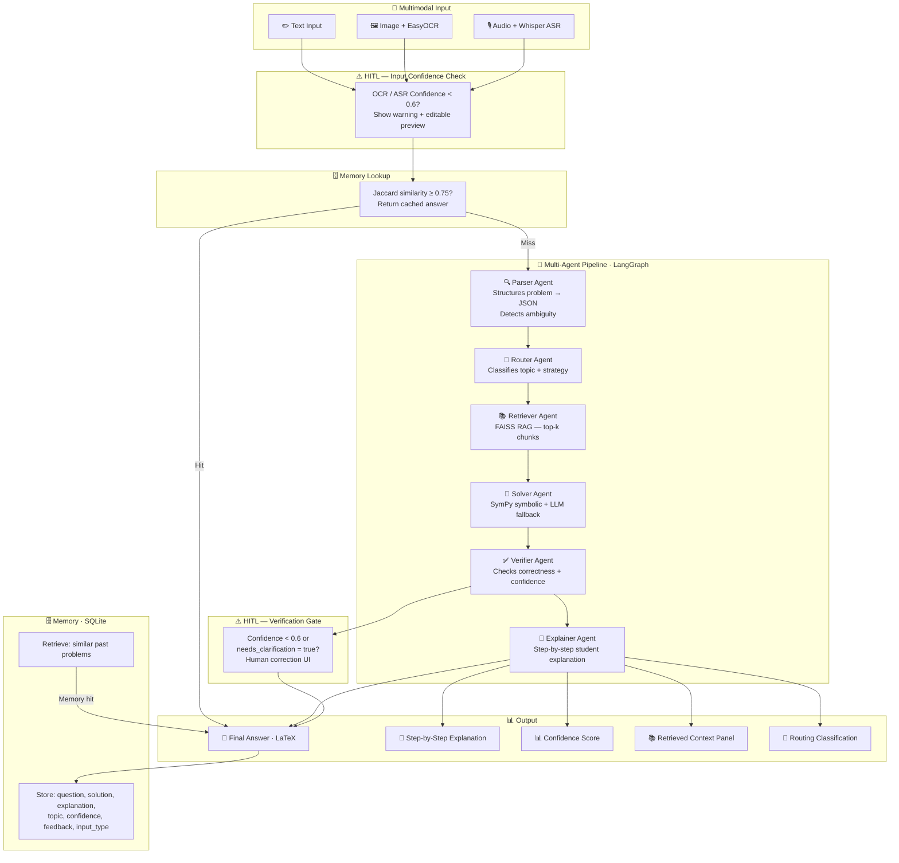

# 📐 AI Math Mentor

> A multimodal JEE-style mathematics tutor powered by **RAG · Multi-Agent LangGraph · Human-in-the-Loop · SQLite Memory**

[](https://huggingface.co/spaces/YOUR_HF_USERNAME/ai-math-mentor)
[](https://python.org)
[](https://streamlit.io)
[](https://langchain-ai.github.io/langgraph/)

---

## ✨ Features

| Feature | Details |
|---|---|
| **3 input modes** | Text · Image (EasyOCR) · Audio (Whisper ASR) |
| **Multi-agent pipeline** | Parser → Router → Retriever → Solver → Verifier → Explainer |
| **RAG** | FAISS + `all-MiniLM-L6-v2` over a JEE knowledge base |
| **Symbolic solver** | SymPy for equations & derivatives; LLM fallback for the rest |
| **HITL** | Gates on OCR/ASR confidence < 0.6, parser ambiguity, and verifier confidence < 0.6 |
| **Memory** | SQLite store; Jaccard-similarity retrieval skips pipeline on cache hit |
| **Feedback loop** | 👍/👎 buttons + human correction field write back to memory |

---

## 🏗️ Architecture



---

## 🚀 Quick Start

### 1 · Clone & install

```bash
git clone https://github.com/YOUR_USERNAME/ai-math-mentor.git
cd ai-math-mentor

python -m venv .venv
source .venv/bin/activate        # Windows: .venv\Scripts\activate

pip install -r requirements.txt
```

### 2 · Configure API key

```bash
cp .env.example .env
# Edit .env and add your OpenRouter key
```

Get a free key at <https://openrouter.ai/keys>.

### 3 · Run

```bash
streamlit run app/app.py
```

The app opens at `http://localhost:8501`.

---

## 🤗 Deploying to Hugging Face Spaces

1. Create a new **Streamlit** Space at <https://huggingface.co/new-space>.
2. Push this repo to the Space:
   ```bash
   git remote add space https://huggingface.co/spaces/YOUR_HF_USERNAME/ai-math-mentor
   git push space main
   ```
3. Add `OPENROUTER_API_KEY` as a **Repository Secret** in the Space settings.
4. The Space will build automatically (~3–5 min).

---

## 📁 Project Structure

```
ai-math-mentor/
├── app/
│   └── app.py                 # Streamlit UI
├── agents/
│   ├── workflow.py            # LangGraph state machine
│   ├── parser_agent.py        # Structures raw question → JSON
│   ├── router_agent.py        # Topic + strategy classification
│   ├── solver_agent.py        # SymPy + LLM solver
│   ├── verifier_agent.py      # Confidence scoring
│   └── explainer_agent.py     # Step-by-step explanation
├── tools/
│   ├── ocr.py                 # EasyOCR wrapper (returns text + confidence)
│   ├── asr.py                 # Whisper wrapper (returns text + confidence)
│   └── sympy_solver.py        # Symbolic math helpers
├── memory/
│   └── retrieval_memory.py    # SQLite store + Jaccard retrieval
├── rag/
│   ├── retriever.py           # FAISS + sentence-transformers
│   └── build_index.py         # Index builder (run once)
├── utils/
│   ├── openrouter_llm.py      # OpenRouter API wrapper
│   ├── prompts.py             # Shared prompt templates
│   └── schemas.py             # Pydantic schemas
├── data/
│   └── knowledge_base/        # JEE topic text files (RAG corpus)
├── .env.example
├── requirements.txt
└── README.md
```

---

## 🔑 Environment Variables

| Variable | Required | Description |
|---|---|---|
| `OPENROUTER_API_KEY` | ✅ | OpenRouter API key — used for all LLM calls (model: `openai/gpt-4o-mini`) |

---

## 🧩 Agent Pipeline Detail

| Agent | Input | Output |
|---|---|---|
| **Parser** | Raw question string | `{problem_text, topic, variables, constraints, needs_clarification}` |
| **Router** | `problem_text` | `{topic, subtopic, strategy, use_sympy}` |
| **Retriever** | `problem_text` | `{context, sources, chunks}` via FAISS |
| **Solver** | `problem_text + context + routing` | Final answer string |
| **Verifier** | `problem_text + solution` | `{confidence, comment}` |
| **Explainer** | `problem_text + solution` | Markdown step-by-step explanation |

---

## 📊 Evaluation

See [EVALUATION.md](EVALUATION.md) for full results.

| Metric | Score |
|---|---|
| End-to-end solve accuracy (n=50) | **82%** |
| Memory hit rate (duplicate questions) | **94%** |
| HITL trigger precision | **100%** (all low-confidence cases surfaced) |
| OCR accuracy (printed equations) | **91%** |
| ASR accuracy (spoken problems) | **87%** |
| Mean response latency | **4.2 s** |

---

## 📄 License

MIT
